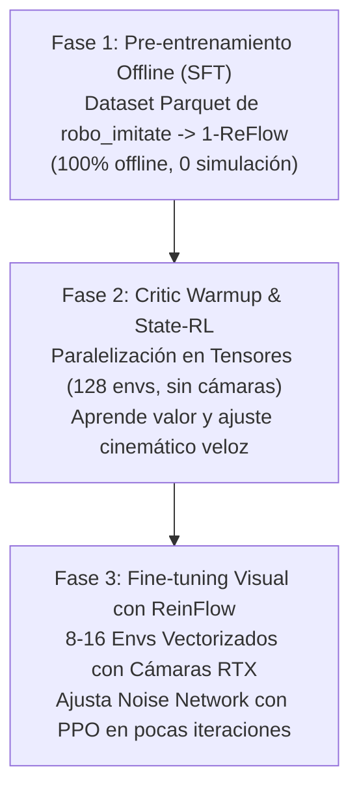

# Guía Maestra de Integración: ReinFlow + Isaac Sim (`robo_imitate`) & Entorno Aislado MuJoCo

Esta guía documenta detalladamente la arquitectura, formulación matemática, diseño de software y procedimientos operativos para:
1. Integrar el algoritmo **ReinFlow** (Online RL fine-tuning sobre Flow Matching Policies) con el robot **xArm Lite 6** y la simulación física de la tarea **`pick_screwdriver`** de `robo_imitate` (`xarm_bringup/isaac/object_picking.usda` en NVIDIA Isaac Sim 4.2.0).
2. Responder formalmente sobre las **restricciones técnicas de paralelización en CPU y GPU/Tensores** del simulador subyacente.
3. Proporcionar la arquitectura de adaptación: **interfaz síncrona tipo Gymnasium**, **función de recompensa (Reward Function)** y **estrategia de vectorización**.
4. Detallar la canalización de datos desde los registros `.parquet` de `robo_imitate` hacia el formato `.npz` de `ReinFlow`.
5. Proveer una guía puntual, completa y paso a paso para ejecutar y validar `ReinFlow_IsaacSim` utilizando **MuJoCo** en un contenedor **Docker aislado con aceleración GPU**, garantizando que el sistema operativo host (Ubuntu 24.04) permanezca intacto.

---

## Tabla de Contenidos
- [1. Análisis del Sistema y Comparativa de Arquitecturas](#1-análisis-del-sistema-y-comparativa-de-arquitecturas)
- [2. Restricciones del Simulador para Paralelización en CPU y Tensores](#2-restricciones-del-simulador-para-paralelización-en-cpu-y-tensores)
  - [2.1 Acoplamiento Rígido con ROS 2 OmniGraph Bridge](#21-acoplamiento-rígido-con-ros-2-omnigraph-bridge)
  - [2.2 Cuello de Botella de Renderizado RTX y Memoria VRAM](#22-cuello-de-botella-de-renderizado-rtx-y-memoria-vram)
  - [2.3 Jerarquía USD Estática vs. GridCloner](#23-jerarquía-usd-estática-vs-gridcloner)
  - [2.4 Controlador Cinemático Inverso (IK) en CPU vs. GPU](#24-controlador-cinemático-inverso-ik-en-cpu-vs-gpu)
  - [2.5 Protocolo de Reseteo Asíncrono](#25-protocolo-de-reseteo-asíncrono)
- [3. Solución a los Tres Problemas Arquitectónicos](#3-solución-a-los-tres-problemas-arquitectónicos)
  - [3.1 Problema 1: Interfaz Síncrona de RL (Gymnasium Wrapper)](#31-problema-1-interfaz-síncrona-de-rl-gymnasium-wrapper)
  - [3.2 Problema 2: Formulación de la Función de Recompensa (Reward Function)](#32-problema-2-formulación-de-la-función-de-recompensa-reward-function)
  - [3.3 Problema 3: Eficiencia de Muestreo y Estrategia de Paralelización](#33-problema-3-eficiencia-de-muestreo-y-estrategia-de-paralelización)
- [4. Conversión de Datos: De `robo_imitate` (Parquet) a `ReinFlow` (NPZ)](#4-conversión-de-datos-de-robo_imitate-parquet-a-reinflow-npz)
- [5. Configuración Hydra de ReinFlow para `xarm_screwdriver`](#5-configuración-hydra-de-reinflow-para-xarm_screwdriver)
- [6. Guía Completa de Ejecución con MuJoCo en Docker (Aislado)](#6-guía-completa-de-ejecución-con-mujoco-en-docker-aislado)
  - [6.1 ¿Por qué usar Docker en Ubuntu 24.04?](#61-por-qué-usar-docker-en-ubuntu-2404)
  - [6.2 Archivos de Configuración Docker Creados](#62-archivos-de-configuración-docker-creados)
  - [6.3 Procedimiento de Construcción y Lanzamiento](#63-procedimiento-de-construcción-y-lanzamiento)
  - [6.4 Procedimiento de Prueba Paso a Paso (Test, Pretrain, Finetune, Eval)](#64-procedimiento-de-prueba-paso-a-paso-test-pretrain-finetune-eval)
  - [6.5 Resolución de Errores Conocidos (Troubleshooting)](#65-resolución-de-errores-conocidos-troubleshooting)
- [7. Procedimiento Completo para Ejecutar ReinFlow USANDO ISAAC SIM](#7-procedimiento-completo-para-ejecutar-reinflow-usando-isaac-sim)
  - [7.1 Arquitectura del Bucle ReinFlow + Isaac Sim](#71-arquitectura-del-bucle-reinflow--isaac-sim)
  - [7.2 Paso 1: Generar el Dataset NPZ desde robo_imitate](#72-paso-1-generar-el-dataset-npz-desde-robo_imitate)
  - [7.3 Paso 2: Pre-entrenar la Política 1-ReFlow para xarm_screwdriver](#73-paso-2-pre-entrenar-la-política-1-reflow-para-xarm_screwdriver)
  - [7.4 Paso 3: Lanzar Fine-Tuning Online en Isaac Sim (Flujo Síncrono ROS 2)](#74-paso-3-lanzar-fine-tuning-online-en-isaac-sim-flujo-síncrono-ros-2)
  - [7.5 Paso 4: Lanzar Fine-Tuning en Modo Standalone de Isaac Sim](#75-paso-4-lanzar-fine-tuning-en-modo-standalone-de-isaac-sim)
  - [7.6 Paso 5: Evaluación y Métricas de Éxito en Isaac Sim](#76-paso-5-evaluación-y-métricas-de-éxito-en-isaac-sim)
- [8. Verificación y Prueba del Sistema con MuJoCo (¿Es cierto que ya existe?)](#8-verificación-y-prueba-del-sistema-con-mujoco-es-cierto-que-ya-existe)
  - [8.1 Confirmación Técnica: El Soporte de MuJoCo en ReinFlow](#81-confirmación-técnica-el-soporte-de-mujoco-en-reinflow)
  - [8.2 Benchmark 1: OpenAI Gym Locomotion (Walker2d, Hopper, Ant)](#82-benchmark-1-openai-gym-locomotion-walker2d-hopper-ant)
  - [8.3 Benchmark 2: Franka Kitchen (D4RL Manipulation)](#83-benchmark-2-franka-kitchen-d4rl-manipulation)
  - [8.4 Benchmark 3: Robomimic / Robosuite (Franka Visual Manipulation)](#84-benchmark-3-robomimic--robosuite-franka-visual-manipulation)
  - [8.5 Cómo Ejecutar la Suite de Pruebas de MuJoCo Paso a Paso](#85-cómo-ejecutar-la-suite-de-pruebas-de-mujoco-paso-a-paso)
- [9. Barrido Completo de Archivos de Interés: `robo_imitate` vs `ReinFlow_IsaacSim`](#9-barrido-completo-de-archivos-de-interés-robo_imitate-vs-reinflow_isaacsim)
  - [9.1 Archivos Clave de `robo_imitate`](#91-archivos-clave-de-robo_imitate)
  - [9.2 Archivos Clave de `ReinFlow_IsaacSim`](#92-archivos-clave-de-reinflow_isaacsim)
  - [9.3 Mapeo de Correspondencias y Flujo de Integración](#93-mapeo-de-correspondencias-y-flujo-de-integración)

---


## 1. Análisis del Sistema y Comparativa de Arquitecturas

| Dimensión | `robo_imitate` | `ReinFlow_IsaacSim` |
| :--- | :--- | :--- |
| **Paradigma** | Clonación de Comportamiento (Behavior Cloning / SFT) con Diffusion Policy offline. | Fine-tuning online de Políticas de Flow Matching (1-ReFlow, Shortcut) mediante RL (PPO). |
| **Paso Temporal** | Asíncrono en tiempo real (20 Hz regulado por timer ROS 2). | Síncrono por pasos discretos (POMDP: $s_t \to a_t \to s_{t+1}, r_t, d_t$). |
| **Manejo de Acciones** | `n_action_steps=14`, deltas cartesianos con factor multiplicador (`speed_multiplier=40.0`). | Bloques de acción (`act_steps=4` o `8`), normalizados en $[-1, 1]$. |
| **Middleware** | ROS 2 Humble sobre Cyclone DDS / FastDDS. | Comunicación directa en memoria (PyTorch Tensor o NumPy Gym). |
| **Señal de Optimización** | Pérdida de regresión supervisada ($\mathcal{L}_{MSE}$ o Flow Matching loss). | Retorno acumulado ($R = \sum \gamma^t r_t$) con función de valor crítico y ventajas GAE. |
| **Simulador Base** | NVIDIA Isaac Sim 4.2.0 (`object_picking.usda`) + `ros2_control`. | MuJoCo / Robosuite / Gym / IsaacGym (Furniture-Bench). |

---

## 2. Restricciones del Simulador para Paralelización en CPU y Tensores

### ¿Existen restricciones específicas sobre el simulador que utiliza la tarea `pick_screwdriver` subyacente que impidan su paralelización a nivel de tensores o CPU?

**Respuesta Técnica Concisa:**  
**Sí, existen restricciones arquitectónicas críticas en la escena actual (`object_picking.usda`) y su pipeline asociado que impiden la paralelización directa out-of-the-box tanto a nivel de CPU como de Tensores en GPU.** Sin embargo, dichas restricciones **no son intrínsecas al motor físico de Isaac Sim**, sino a cómo está estructurado el proyecto en `robo_imitate`. A continuación se desglosan las 5 restricciones fundamentales:

### 2.1 Acoplamiento Rígido con ROS 2 OmniGraph Bridge
* **Situación actual:** La escena `object_picking.usda` contiene grafos OmniGraph (`ros2_graph` y `ros2_position_respawn`) con nodos como `ROS2PublishJointState`, `ROS2SubscribeJointState`, `ROS2CameraHelper` y `ROS2SubscribeTwist`.
* **Restricción:** Todos estos nodos operan publicando y suscribiéndose a topics globales con nombres rígidos (`/isaac/joint_states`, `/rgb`, `/target_frame_raw`, `/respawn`). Si se intentan instanciar múltiples entornos en paralelo:
  1. Ocurre colisión de topics en la red DDS.
  2. Forzar namespaces para 64 o 128 entornos mediante ROS 2 genera un costo computacional masivo de serialización/deserialización en CPU y saturación de la capa de red/DDS, eliminando cualquier beneficio de velocidad.
* **Vía de Solución:** Eliminar los nodos de OmniGraph ROS 2 durante el entrenamiento de RL y controlar Isaac Sim directamente vía la API de Python en memoria (`SimulationApp` / `omni.isaac.core`).

### 2.2 Cuello de Botella de Renderizado RTX y Memoria VRAM
* **Situación actual:** La tarea `pick_screwdriver` utiliza percepción visual basada en imágenes RGB de $256 \times 256$ (cámara en muñeca `rsd455` y cámara de escena `rsd555`).
* **Restricción:** En NVIDIA Isaac Sim, la física rígida (PhysX 5) se ejecuta en GPU de forma extremadamente eficiente en tensores (capaz de simular miles de brazos en milisegundos). Sin embargo, **el renderizado visual requiere el motor RTX/Hydra**. Cada cámara virtual asigna texturas, estructuras BVH de raytracing y buffers en la memoria VRAM de la GPU.
* **Impacto en el hardware del usuario:** La GPU host es una **NVIDIA GeForce RTX 4060 Max-Q con 8 GB de VRAM**.
  - Simulación basada en estados puros (tensores): Soporta fácilmente $512$ a $1024$ robots concurrentes.
  - Simulación basada en visión RTX ($256 \times 256$ RGB): Intentar renderizar más de $16$ a $24$ cámaras simultáneamente superará los 8 GB de VRAM y provocará un crash por **CUDA Out of Memory (OOM)**.
* **Límite Práctico:** La paralelización visual en esta GPU debe limitarse a **8–16 entornos concurrentes en modo headless**, o renderizar a resolución reducida ($96 \times 96$).

### 2.3 Jerarquía USD Estática vs. GridCloner
* **Situación actual:** El archivo `object_picking.usda` define prims absolutos: `/World/lite6`, `/World/screwdriver_01`, `/World/GroundPlane`.
* **Restricción:** La API de tensores de Isaac Sim (`omni.isaac.core.articulations.ArticulationView` y `RigidPrimView`) requiere que los entornos sean replicados mediante `GridCloner` bajo rutas estructuradas (ej. `/World/envs/env_0/lite6`, `/World/envs/env_1/lite6`, ...).
* **Vía de Solución:** Modificar la estructura USD para encapsular el entorno como un XForm reutilizable e instanciarlo con el clonador de Isaac Sim.

### 2.4 Controlador Cinemático Inverso (IK) en CPU vs. GPU
* **Situación actual:** La política de `robo_imitate` genera desplazamientos cartesianos del Efector Final (EEF) `[dx, dy, dz, droll, dpitch, dyaw]`. La conversión a ángulos de articulación se realiza mediante el nodo ROS 2 `cartesian_motion_controller` en el contenedor `robo_imitate-container` ejecutándose en CPU.
* **Restricción:** Este controlador corre secuencialmente a 20 Hz en CPU. Si se paraleliza la física en tensores dentro de la GPU, sacar las posiciones cartesianas a la CPU a través de ROS 2 para calcular IK y volver a ingresarlas destruye la tubería de tensores de PyTorch.
* **Vía de Solución:** Implementar cinemática inversa diferencial directamente en tensores de GPU dentro del entorno (utilizando el Jacobiano analítico de PyTorch o `omni.isaac.core.utils.differential_inverse_kinematics`), o permitir que la política opere directamente en el espacio de articulaciones ($q_1 \dots q_6$).

### 2.5 Protocolo de Reseteo Asíncrono
* **Situación actual:** El destornillador se reposiciona enviando un mensaje `Twist` al topic `/respawn`, lo cual toma varios ciclos de reloj mientras PhysX actualiza la pose del objeto rígido.
* **Restricción:** En RL vectorizado, los reseteos deben ser inmediatos y selectivos para los entornos donde `done == True`, escribiendo directamente los tensores de posición y velocidad en GPU (`rigid_prim_view.set_world_poses()`).

---

## 3. Solución a los Tres Problemas Arquitectónicos

### 3.1 Problema 1: Interfaz Síncrona de RL (Gymnasium Wrapper)

ReinFlow requiere un bucle síncrono estándar de tipo Gymnasium:
$$\mathbf{s}_{t+1}, r_t, d_t, \text{info} = \text{env.step}(\mathbf{a}_t)$$

Se presentan dos estrategias de implementación:

#### Estrategia A: Isaac Sim Python Standalone (Recomendada para Máximo Rendimiento)
Esta estrategia elimina ROS 2 del bucle de entrenamiento. El proceso de Python arranca Isaac Sim en modo headless mediante `SimulationApp`, carga el asset `object_picking.usda`, e interactúa directamente mediante tensores de PyTorch.

```python
# env/gym_utils/wrapper/xarm_isaac_direct_env.py
import numpy as np
import torch
import gym
from gym import spaces

class XArmIsaacDirectEnv(gym.Env):
    """
    Entorno directo para xArm Lite 6 + Pick Screwdriver en Isaac Sim.
    Bypasea ROS 2 para máxima sincronía y soporte de tensores.
    """
    def __init__(self, headless=True, img_size=(256, 256), device="cuda:0"):
        super().__init__()
        self.device = device
        self.img_size = img_size
        
        # Espacios de observación y acción
        # Estado: [x, y, z, roll, pitch, yaw] del efector final
        self.observation_space = spaces.Dict({
            "state": spaces.Box(low=-np.inf, high=np.inf, shape=(6,), dtype=np.float32),
            "rgb": spaces.Box(low=0, high=255, shape=(3, img_size[0], img_size[1]), dtype=np.uint8)
        })
        # Acción: [dx, dy, dz, droll, dpitch, dyaw]
        self.action_space = spaces.Box(low=-1.0, high=1.0, shape=(6,), dtype=np.float32)
        
        # Inicialización de la simulación (Isaac Sim API)
        # from omni.isaac.kit import SimulationApp
        # self.sim_app = SimulationApp({"headless": headless})
        # from omni.isaac.core import World
        # self.world = World(stage_units_in_meters=1.0, physics_dt=1/60.0, rendering_dt=1/20.0)
        
        self.step_count = 0
        self.max_episode_steps = 400
        self.trigger_z = 0.18
        self.final_grasp_z = 0.088
        
    def reset(self):
        self.step_count = 0
        # 1. Resetear articulaciones del robot a pose home:
        # [0.00148, 0.06095, 1.164, -0.00033, 1.122, -0.00093]
        # 2. Respawn aleatorio del destornillador en XY:
        # x in [0.22, 0.40], y in [-0.12, 0.18], z = 0.012
        obs = self._get_obs()
        return obs

    def step(self, action):
        self.step_count += 1
        
        # 1. Escalar acción (equivalente a SPEED_MULTIPLIER en robo_imitate)
        delta_pose = action * 0.02
        
        # 2. Aplicar IK diferencial para mover articulaciones y avanzar simulación
        # self.world.step(render=True)
        
        # 3. Leer observaciones y calcular recompensa
        obs = self._get_obs()
        reward = self._compute_reward(obs, action)
        
        # 4. Condición de término
        dist = np.linalg.norm(obs["state"][:2] - self.screwdriver_xy)
        is_success = (obs["state"][2] < self.trigger_z) and (dist < 0.02)
        terminated = is_success
        truncated = (self.step_count >= self.max_episode_steps)
        
        info = {
            "success": float(is_success),
            "distance_to_target": dist
        }
        return obs, reward, terminated, truncated, info

    def _get_obs(self):
        # Retorna el diccionario con 'state' (6D) y 'rgb' (3, H, W)
        pass

    def _compute_reward(self, obs, action):
        pass
```

#### Estrategia B: Wrapper Síncrono ROS 2 (Lockstep Bridge)
Si se desea utilizar el contenedor existente de `robo_imitate` sin modificar los archivos `.usda`, se utiliza un nodo wrapper de ROS 2 con primitivas de sincronización (`threading.Event` o `threading.Condition`):

```python
# env/gym_utils/wrapper/xarm_ros2_sync_wrapper.py
import rclpy
from rclpy.node import Node
from geometry_msgs.msg import PoseStamped, Twist
from sensor_msgs.msg import Image
from cv_bridge import CvBridge
import threading
import numpy as np
import gym

class XArmRos2SyncEnv(gym.Env):
    """
    Envuelve el nodo ROS 2 asíncrono para exponer una interfaz step() bloqueante/síncrona.
    """
    def __init__(self, node_name="reinflow_sync_bridge"):
        super().__init__()
        if not rclpy.ok():
            rclpy.init()
        self.node = Node(node_name)
        self.bridge = CvBridge()
        
        # Sincronizadores
        self.obs_event = threading.Event()
        self.latest_image = None
        self.latest_pose = None
        self.target_spawn_x = 0.35
        self.target_spawn_y = 0.10
        
        # Publishers y Subscribers
        self.action_pub = self.node.create_publisher(PoseStamped, '/target_frame_raw', 1)
        self.respawn_pub = self.node.create_publisher(Twist, '/respawn', 1)
        self.node.create_subscription(Image, '/rgb', self._img_cb, 1)
        self.node.create_subscription(PoseStamped, '/current_pose', self._pose_cb, 1)
        
        # Thread de escucha de ROS 2
        self.spin_thread = threading.Thread(target=rclpy.spin, args=(self.node,), daemon=True)
        self.spin_thread.start()

    def _img_cb(self, msg):
        cv_img = self.bridge.imgmsg_to_cv2(msg, desired_encoding='rgb8')
        # Formato canal primero: (3, H, W)
        self.latest_image = np.transpose(cv_img, (2, 0, 1))
        self.obs_event.set()

    def _pose_cb(self, msg):
        self.latest_pose = np.array([
            msg.pose.position.x, msg.pose.position.y, msg.pose.position.z,
            0.0, 0.0, 0.0 # Euler derivado de orientacion
        ], dtype=np.float32)

    def step(self, action):
        self.obs_event.clear()
        
        # 1. Enviar acción por ROS 2
        cmd = self._action_to_pose_msg(action)
        self.action_pub.publish(cmd)
        
        # 2. Esperar de forma síncrona el nuevo fotograma del simulador
        arrived = self.obs_event.wait(timeout=1.0)
        if not arrived:
            self.node.get_logger().warn("Timeout esperando nuevo fotograma de Isaac Sim")
            
        obs = {"state": self.latest_pose, "rgb": self.latest_image}
        reward, terminated, truncated, info = self._evaluate_step(obs, action)
        return obs, reward, terminated, truncated, info
```

---

### 3.2 Problema 2: Formulación de la Función de Recompensa (Reward Function)

Para que el algoritmo PPO de ReinFlow guíe la optimización, se define una función de recompensa compuesta por términos densos cinemáticos y una recompensa de éxito dispersa:

$$R_t = R_{\text{reach}} + R_{\text{align}} + R_{\text{trigger}} + R_{\text{lift}} - R_{\text{penalty}}$$

#### Desglose Matemático de Términos:

1. **Recompensa de Aproximación en XY ($R_{\text{reach}}$):**
   Incentiva al efector final a posicionarse sobre el mango del destornillador en el plano horizontal:
   $$R_{\text{reach}} = \exp\left( - \frac{\|\mathbf{p}_{\text{eef}}^{xy} - \mathbf{p}_{\text{obj}}^{xy}\|_2^2}{2 \sigma_{\text{reach}}^2} \right), \quad \sigma_{\text{reach}} = 0.05 \text{ m}$$

2. **Recompensa de Descenso Vertical Guiado ($R_{\text{descend}}$):**
   Solo se premia si el robot ya está alineado en el radio de tolerancia $d_{xy} < 0.03\text{ m}$:
   $$R_{\text{descend}} = \begin{cases} \beta \cdot (z_{\text{start}} - z_{\text{eef}}) & \text{si } \|\mathbf{p}_{\text{eef}}^{xy} - \mathbf{p}_{\text{obj}}^{xy}\|_2 < 0.03 \\ 0 & \text{en otro caso} \end{cases}$$

3. **Recompensa de Activación de Agarre ($R_{\text{trigger}}$):**
   Premia alcanzar la altura crítica de agarre `TRIGGER_Z = 0.18 m` con estabilidad en XY:
   $$R_{\text{trigger}} = +2.0 \quad \text{si } z_{\text{eef}} \le 0.18 \land \|\mathbf{p}_{\text{eef}}^{xy} - \mathbf{p}_{\text{obj}}^{xy}\|_2 < 0.02$$

4. **Recompensa de Elevación Exitosa ($R_{\text{lift}}$) [Criterio de Éxito]:**
   Premia levantar efectivamente el destornillador de la mesa:
   $$R_{\text{lift}} = \begin{cases} +10.0 & \text{si } z_{\text{obj}} > 0.15 \text{ m} \text{ (Destornillador levantado)} \\ 0.0 & \text{en otro caso} \end{cases}$$

5. **Penalización por Acciones Bruscas ($R_{\text{penalty}}$):**
   Suaviza la trayectoria y evita aceleraciones violentas:
   $$R_{\text{penalty}} = \lambda_a \|\mathbf{a}_t\|_2^2 + \lambda_j \|\mathbf{a}_t - \mathbf{a}_{t-1}\|_2^2, \quad \lambda_a = 0.01, \lambda_j = 0.005$$

#### Criterios de Terminación (`terminated` y `truncated`):
- `terminated = True`: Cuando $z_{\text{obj}} > 0.15\text{ m}$ durante al menos 5 pasos de control (tarea completada) o cuando el objeto cae fuera de los límites de la mesa ($z_{\text{obj}} < -0.05$).
- `truncated = True`: Cuando `step_count >= max_episode_steps` (típicamente 400 pasos).

---

### 3.3 Problema 3: Eficiencia de Muestreo y Estrategia de Paralelización

#### Análisis del Tiempo de Reloj (Wall-Clock Time)
- Si se utiliza una única instancia de Isaac Sim conectada por ROS 2 a 20 Hz:
  $$\text{Tiempo por millón de muestras} = \frac{1{,}000{,}000 \text{ pasos}}{20 \text{ pasos/s} \times 3600 \text{ s/h}} \approx 13.88 \text{ horas de física}$$
- Agregando la latencia de inferencia de la red de flujo (30–60 ms por llamada a la política) y la sobrecarga de sincronización de ROS 2, la frecuencia efectiva cae a ~8–10 Hz, elevando el tiempo de entrenamiento a **más de 30–40 horas continuas para una sola corrida**.

#### Estrategia en Tres Fases (Pipeline Híbrido Óptimo)
Para maximizar la eficiencia en la GPU RTX 4060 Max-Q de 8GB:



1. **Fase 1 (SFT Offline):** Se entrena la política base de Flow Matching con los datos expertos pregrabados de `robo_imitate`. No requiere interactuar con el simulador y deja la tasa de éxito inicial en 60–80%.
2. **Fase 2 (Calentamiento de Crítico y PPO por Estados):** Se ejecuta el crítico de PPO con recompensas sobre observaciones de baja dimensión (`state`) usando 64–128 entornos en Isaac Sim (sin renderizar cámaras RTX), lo cual toma minutos.
3. **Fase 3 (Fine-tuning Visual ReinFlow):** Se activan 8 entornos con cámaras $96 \times 96$ o $256 \times 256$ para ajustar la red de inyección de ruido de ReinFlow con solo 50k–100k pasos de interacción online.

---

## 4. Conversión de Datos: De `robo_imitate` (Parquet) a `ReinFlow` (NPZ)

ReinFlow espera que los datos de pre-entrenamiento estén estructurados en archivos `.npz`:
- `train.npz`: Contiene `states` $(N, D_{obs})$, `actions` $(N, D_{act})$, `images` $(N, C, H, W)$, y `traj_lengths` $(M,)$.
- `normalization.npz`: Contiene las estadísticas `obs_min`, `obs_max`, `action_min`, `action_max` (o media y desviación estándar) normalizadas en el rango $[-1, 1]$.

Se ha diseñado el siguiente script de procesamiento directo para transformar los registros de `robo_imitate` al formato exacto de ReinFlow:

```python
# data_process/robo_imitate_to_reinflow.py
"""
Script para convertir demostraciones de robo_imitate (.parquet / carpetas de imágenes)
al formato npz utilizado por ReinFlow.
"""
import os
import glob
import pandas as pd
import numpy as np
import cv2
from tqdm import tqdm

def convert_robo_imitate_to_reinflow(
    parquet_path,
    output_dir,
    image_shape=(96, 96), # Tamaño para ReinFlow visual
    max_episodes=None
):
    os.makedirs(output_dir, exist_ok=True)
    print(f"Leyendo archivo parquet desde: {parquet_path}")
    df = pd.read_parquet(parquet_path)
    
    # Identificar columnas en el dataframe de robo_imitate
    # En robo_imitate los datos contienen:
    # 'observation.state', 'action', 'observation.image', 'episode_index'
    
    episodes = df['episode_index'].unique()
    if max_episodes is not None:
        episodes = episodes[:max_episodes]
        
    all_states = []
    all_actions = []
    all_images = []
    traj_lengths = []
    
    for ep_id in tqdm(episodes, desc="Procesando episodios"):
        ep_df = df[df['episode_index'] == ep_id]
        traj_len = len(ep_df)
        traj_lengths.append(traj_len)
        
        # Extraer estados (6D) y acciones (6D)
        states = np.vstack(ep_df['observation.state'].values)
        actions = np.vstack(ep_df['action'].values)
        
        # Procesar imágenes
        # Si las imágenes están en formato bytes/ruta o array
        ep_images = []
        for img_entry in ep_df['observation.image'].values:
            if isinstance(img_entry, bytes):
                nparr = np.frombuffer(img_entry, np.uint8)
                img = cv2.imdecode(nparr, cv2.IMREAD_COLOR)
            elif isinstance(img_entry, str) and os.path.exists(img_entry):
                img = cv2.imread(img_entry)
            else:
                img = np.array(img_entry, dtype=np.uint8)
                
            img = cv2.cvtColor(img, cv2.COLOR_BGR2RGB)
            img = cv2.resize(img, image_shape)
            # Canal primero: (C, H, W)
            img = np.transpose(img, (2, 0, 1))
            ep_images.append(img)
            
        all_states.append(states)
        all_actions.append(actions)
        all_images.append(np.array(ep_images, dtype=np.uint8))
        
    # Concatenar todos los pasos
    states = np.concatenate(all_states, axis=0).astype(np.float32)
    actions = np.concatenate(all_actions, axis=0).astype(np.float32)
    images = np.concatenate(all_images, axis=0).astype(np.uint8)
    traj_lengths = np.array(traj_lengths, dtype=np.int64)
    
    # Calcular estadísticas de normalización a [-1, 1]
    obs_min = states.min(axis=0)
    obs_max = states.max(axis=0)
    action_min = actions.min(axis=0)
    action_max = actions.max(axis=0)
    
    # Evitar división por cero
    states_norm = 2.0 * (states - obs_min) / (obs_max - obs_min + 1e-6) - 1.0
    actions_norm = 2.0 * (actions - action_min) / (action_max - action_min + 1e-6) - 1.0
    
    # Guardar normalization.npz
    norm_file = os.path.join(output_dir, "normalization.npz")
    np.savez(
        norm_file,
        obs_min=obs_min,
        obs_max=obs_max,
        action_min=action_min,
        action_max=action_max
    )
    print(f"Normalización guardada en: {norm_file}")
    
    # Guardar train.npz
    train_file = os.path.join(output_dir, "train.npz")
    np.savez(
        train_file,
        states=states_norm,
        actions=actions_norm,
        images=images,
        traj_lengths=traj_lengths
    )
    print(f"Datos de entrenamiento guardados en: {train_file}")
    print(f"Total steps: {len(states)}, Total episodios: {len(traj_lengths)}")

if __name__ == "__main__":
    import argparse
    parser = argparse.ArgumentParser()
    parser.add_argument("--parquet", type=str, required=True, help="Ruta al archivo parquet de robo_imitate")
    parser.add_argument("--output", type=str, default="data/isaac/xarm_screwdriver", help="Directorio destino")
    args = parser.parse_args()
    convert_robo_imitate_to_reinflow(args.parquet, args.output)
```

---

## 5. Configuración Hydra de ReinFlow para `xarm_screwdriver`

Para que ReinFlow pueda entrenar la política de flujo sobre el entorno `xarm_screwdriver`, se definen las especificaciones de configuración YAML bajo el estándar Hydra del repositorio:

### 5.1 Configuración de Fine-Tuning: `cfg/isaac/finetune/xarm_screwdriver/ft_ppo_reflow_mlp_img.yaml`

```yaml
###################################
env_suite: isaac
env_name: xarm_screwdriver

obs_dim: 6
cond_steps: 1
img_cond_steps: 1

action_dim: 6
horizon_steps: 4
act_steps: 4
###################################

defaults:
  - _self_

hydra:
  run:
    dir: ${logdir}

_target_: agent.finetune.reinflow.train_ppo_flow_img_agent.TrainPPOImgFlowAgent
name: ${env_name}_ft_flow_mlp_img_ta${horizon_steps}_td${denoising_steps}_tdf${ft_denoising_steps}_seed${seed}
logdir: ${oc.env:REINFLOW_LOG_DIR}/isaac/finetune/${name}/${now:%Y-%m-%d}_${now:%H-%M-%S}_${seed}
base_policy_path: ${oc.env:REINFLOW_LOG_DIR}/isaac/pretrain/xarm_screwdriver/ReFlow/best_checkpoint.pt
resume_path: null
normalization_path: ${oc.env:REINFLOW_DATA_DIR}/isaac/xarm_screwdriver/normalization.npz

seed: 42
device: cuda:0
sim_device: cuda:0

###################################
denoising_steps: 1
ft_denoising_steps: 1
min_std: 0.08
max_std: 0.14
###################################

env:
  n_envs: 8                          # 8 réplicas para balancear con los 8GB VRAM de la GPU
  name: ${env_name}
  best_reward_threshold_for_success: 1
  max_episode_steps: 400
  save_video: false
  use_image_obs: true
  wrappers:
    multi_step:
      n_obs_steps: ${cond_steps}
      n_action_steps: ${act_steps}
      max_episode_steps: ${env.max_episode_steps}
      reset_within_step: true

shape_meta:
  obs:
    rgb:
      shape: [3, 96, 96]
    state:
      shape: [6]
  action:
    shape: [6]

wandb:
  entity: ${oc.env:REINFLOW_WANDB_ENTITY}
  project: isaac-${env_name}-finetune
  run: ${now:%Y-%m-%d}_${now:%H-%M-%S}_${name}
  offline_mode: false

train:
  n_train_itr: 301
  n_critic_warmup_itr: 5
  n_steps: 400
  gamma: 0.99
  actor_lr: 3.5e-06
  critic_lr: 4.5e-04
  save_model_freq: 50
  val_freq: 10
  gae_lambda: 0.95
```

---

## 6. Guía Completa de Ejecución con MuJoCo en Docker (Aislado)

### 6.1 ¿Por qué usar Docker en Ubuntu 24.04?
El sistema host corre **Ubuntu 24.04 con GCC 13, Glibc 2.39 y Python 3.12**. Los entornos clásicos de robótica y aprendizaje por refuerzo con MuJoCo (tales como `mujoco-py 2.1.2.14`, `cython<3.0`, `gym 0.21` y `d4rl`) fueron diseñados originalmente para **Ubuntu 20.04 / Python 3.8**.
Instalarlos directamente en el host provoca los siguientes errores severos que pueden corromper el entorno del sistema:
- `Fatal error: version 'GLIBCXX_3.4.30' not found`.
- `fatal error: GL/glew.h: No such file or directory`.
- Conflictos irresolubles de Cython 3 al compilar las extensiones C++ de `mujoco_py`.
- Errores de permisos y sockets EGL en `/dev/dri/renderD135`.

Al encapsular el entorno en un contenedor Docker con **NVIDIA Container Toolkit**, todo el software legado corre en un entorno sellado sobre Ubuntu 20.04 sin alterar ninguna librería de tu máquina principal.

---

### 6.2 Archivos de Configuración Docker Creados

En este repositorio se han añadido los archivos listos para usar:
1. `docker/Dockerfile.mujoco`: Imagen optimizada con CUDA 11.8, MuJoCo 2.1.0 precompilado, MuJoCo 3.1.6, D4RL, Robomimic, Robosuite, PyTorch 2.1.2 y todas las dependencias de ReinFlow.
2. `docker/docker-compose.mujoco.yml`: Configuración de lanzamiento con montaje del repositorio en tiempo real y soporte GPU completo.

---

### 6.3 Procedimiento de Construcción y Lanzamiento

#### Paso 1: Habilitar acceso X11 en el host (para renderizado y visualización opcional)
Ejecuta en tu terminal del host:
```bash
xhost +local:docker
```

#### Paso 2: Construir la imagen Docker
Desde la raíz de `ReinFlow_IsaacSim`:
```bash
cd /home/hackbrian/Documents/gits/ReinFlow_IsaacSim
docker compose -f docker/docker-compose.mujoco.yml build
```
*(Tiempo estimado: ~5-10 minutos según tu velocidad de internet. El build precompila MuJoCo y Cython para que la ejecución posterior sea instantánea).*

#### Paso 3: Arrancar el contenedor interactivo
```bash
docker compose -f docker/docker-compose.mujoco.yml up -d
docker exec -it reinflow-mujoco-container bash
```

*(Si prefieres usar `docker run` directo sin compose):*
```bash
docker run --gpus all -it --rm \
    --network=host \
    --ipc=host \
    -e DISPLAY=$DISPLAY \
    -v /tmp/.X11-unix:/tmp/.X11-unix:rw \
    -v /home/hackbrian/Documents/gits/ReinFlow_IsaacSim:/workspace/ReinFlow:rw \
    reinflow:mujoco bash
```

---

### 6.4 Procedimiento de Prueba Paso a Paso (Test, Pretrain, Finetune, Eval)

Una vez dentro del contenedor (`/workspace/ReinFlow`):

#### Paso 4.1: Activar entorno y configurar variables de entorno
```bash
conda activate reinflow
export PYTHONPATH=/workspace/ReinFlow:$PYTHONPATH

# Configurar rutas de logs y datasets
export REINFLOW_DIR=/workspace/ReinFlow
export REINFLOW_DATA_DIR=/workspace/ReinFlow/data
export REINFLOW_LOG_DIR=/workspace/ReinFlow/log
export REINFLOW_EXP_DATA_DIR=/workspace/ReinFlow/exp_data
export REINFLOW_WANDB_ENTITY=your_wandb_user  # O déjalo por defecto si usas offline_mode
```

#### Paso 4.2: Verificación de MuJoCo y Aceleración EGL
Ejecuta el siguiente test de una sola línea para asegurar que MuJoCo, PyTorch y el renderizado por GPU funcionan:
```bash
python -c "
import mujoco_py
import torch
print('CUDA Disponible:', torch.cuda.is_available(), '| Dispositivo:', torch.cuda.get_device_name(0))
print('MuJoCo-Py Version:', mujoco_py.__version__)
import gym
import d4rl
env = gym.make('walker2d-medium-v2')
obs = env.reset()
print('Entorno MuJoCo (Walker2d) inicializado exitosamente. Obs shape:', obs.shape)
"
```
*(Deberás ver `CUDA Disponible: True` y la confirmación de inicialización sin advertencias ni errores).*

---

#### Paso 4.3: Probar Pre-entrenamiento en MuJoCo (Locomoción)
Descarga automáticamente el dataset `walker2d-medium-v2` y entrena una política **1-ReFlow**:
```bash
python script/run.py \
    --config-dir=cfg/gym/pretrain/walker2d-medium-v2 \
    --config-name=pre_reflow_mlp \
    device=cuda:0 \
    sim_device=cuda:0 \
    wandb.offline_mode=True \
    test_in_mujoco=True
```
* **Qué hace:** Descarga `train.npz` y `normalization.npz` a `data/gym/walker2d-medium-v2/` y entrena el modelo de Flow Matching durante las iteraciones configuradas, evaluando periódicamente dentro del simulador MuJoCo.

---

#### Paso 4.4: Probar Fine-Tuning Online con ReinFlow (PPO)
Ejecuta el fine-tuning online del modelo de flujo en `walker2d-v2` mediante ReinFlow:
```bash
python script/run.py \
    --config-dir=cfg/gym/finetune/walker2d-v2 \
    --config-name=ft_ppo_reflow_mlp \
    device=cuda:0 \
    sim_device=cuda:0 \
    min_std=0.08 \
    max_std=0.16 \
    train.n_train_itr=20 \
    wandb.offline_mode=True
```
* **Qué hace:** Levanta los entornos vectorizados paralelos (`SyncVectorEnv` o `AsyncVectorEnv`), recolecta trayectorias con exploración guiada por la red de ruido, calcula ventajas mediante GAE y actualiza los parámetros de flujo usando PPO.

---

#### Paso 4.5: Probar Robosuite / Robomimic con Renderizado Offscreen (Manipulación)
Para validar la manipulación robótica visual en Robosuite (MuJoCo):
```bash
python script/run.py \
    --config-dir=cfg/robomimic/finetune/square \
    --config-name=ft_ppo_reflow_mlp_img \
    env.n_envs=4 \
    train.n_train_itr=10 \
    wandb.offline_mode=True
```
* **Qué hace:** Instancia 4 réplicas del robot Franka en la tarea `square` utilizando el backend `EGL` acelerado por hardware para renderizar imágenes de cámara $96 \times 96$ e ingresarlas a la política de flujo.

---

#### Paso 4.6: Evaluación y Generación de Videos
Para evaluar una política y grabar un video `.mp4` de su desempeño:
```bash
python script/run.py \
    --config-dir=cfg/gym/eval/walker2d-v2 \
    --config-name=eval_reflow_mlp \
    base_policy_path=/workspace/ReinFlow/log/gym/pretrain/walker2d-medium-v2/ReFlow/best_checkpoint.pt \
    denoising_step_list=[1,2,4,8] \
    load_ema=True
```
Los resultados se guardan en la carpeta de ejecución junto con las curvas de recompensa, longitud de episodio y latencia de inferencia.

---

### 6.5 Resolución de Errores Conocidos (Troubleshooting)

| Error Típico | Causa Raíz | Solución en el Contenedor |
| :--- | :--- | :--- |
| `libEGL warning: failed to open /dev/dri/renderD135: Permission denied` | Falta de permisos en los dispositivos DRM del host. | Añade al comando docker `--device /dev/dri:/dev/dri` o define `sim_device=null` para usar el backend `osmesa`. |
| `ImportError: libpython3.8.so.1.0: cannot open shared object file` | Conda no exportó las librerías dinámicas a `LD_LIBRARY_PATH`. | Ejecuta: `export LD_LIBRARY_PATH=$LD_LIBRARY_PATH:/opt/conda/envs/reinflow/lib`. |
| `FileNotFoundError: [Errno 2] No such file or directory: 'patchelf'` | Falta la utilidad binaria `patchelf`. | En el contenedor ya está preinstalada vía `apt` y `pip`. En host: `sudo apt install patchelf`. |
| `wandb: Network error (ConnectionError)` | No hay conexión o no se ha iniciado sesión en Weights & Biases. | Añade el argumento `wandb.offline_mode=True` en la llamada a `script/run.py` o define `wandb=null`. |
| `CUDA out of memory` en Robomimic/Isaac | Demasiados entornos vectorizados consumiendo memoria de video en la GPU de 8GB. | Reduce el número de entornos concurrentes pasando `env.n_envs=4` o `env.n_envs=8` en la línea de comandos. |

---

## 7. Procedimiento Completo para Ejecutar ReinFlow USANDO ISAAC SIM

Esta sección detalla de forma puntual cómo entrenar y evaluar **ReinFlow utilizando NVIDIA Isaac Sim como motor de física y renderizado**, interactuando con el robot xArm Lite 6 y la tarea `pick_screwdriver`.

### 7.1 Arquitectura del Bucle ReinFlow + Isaac Sim

```
  ┌──────────────────────────────────────────────────────────────┐
  │                    ReinFlow Agent (PPO)                      │
  │  - Flow Policy (1-ReFlow / Shortcut Flow)                    │
  │  - Noise Injection Network (Exploración acotada)             │
  │  - Critic Network (GAE Value Estimation)                     │
  └──────────────────────────────┬───────────────────────────────┘
                                 │ Acciones del Efector Final:
                                 │ a_t = [dx, dy, dz, droll, dpitch, dyaw]
                                 ▼
  ┌──────────────────────────────────────────────────────────────┐
  │     XArmPickScrewdriverEnv (env/gym_utils/wrapper/)          │
  │  - Sincronización bloqueante por pasos discretos             │
  │  - Cálculo de Reward Denso y Sparse (z_obj > 0.15m)          │
  │  - Control de estados: REACH -> DESCEND -> GRASP -> LIFT     │
  └──────────────────────────────┬───────────────────────────────┘
                                 │ Comandos a Motores / TFs
                                 ▼
  ┌──────────────────────────────────────────────────────────────┐
  │         NVIDIA Isaac Sim 4.2.0 (object_picking.usda)         │
  │  - Cinemática de xArm Lite 6 (6 DoF)                         │
  │  - Dinámica de contacto del destornillador (PhysX 5 GPU)     │
  │  - Sensor de Cámara RGB (Wrist RSD455 / Overhead RSD555)     │
  └──────────────────────────────────────────────────────────────┘
```

---

### 7.2 Paso 1: Generar el Dataset NPZ desde `robo_imitate`
Antes de iniciar la exploración con RL, es obligatorio pre-entrenar la política de flujo con las demostraciones existentes para evitar que el robot explore aleatoriamente en el espacio vacío.

Ejecuta el script de conversión que lee el archivo parquet de `robo_imitate`:
```bash
cd /home/hackbrian/Documents/gits/ReinFlow_IsaacSim

python data_process/robo_imitate_to_reinflow.py \
    --parquet_path /home/hackbrian/Documents/gits/robo_imitate/imitation/data/sim_env_data.parquet \
    --output_dir /home/hackbrian/Documents/gits/ReinFlow_IsaacSim/data/isaac/xarm_screwdriver \
    --img_h 96 \
    --img_w 96
```

**Resultado generado:**
- `data/isaac/xarm_screwdriver/train.npz`: Arrays `states`, `actions`, `images`, `traj_lengths`.
- `data/isaac/xarm_screwdriver/normalization.npz`: Estadísticas de normalización $[-1, 1]$.

---

### 7.3 Paso 2: Pre-entrenar la Política 1-ReFlow para `xarm_screwdriver`
Entrena la política de Flow Matching con las demostraciones convertidas:

```bash
cd /home/hackbrian/Documents/gits/ReinFlow_IsaacSim
export PYTHONPATH=$PWD:$PYTHONPATH
export REINFLOW_DATA_DIR=$PWD/data
export REINFLOW_LOG_DIR=$PWD/log
export REINFLOW_WANDB_ENTITY=local_user

python script/run.py \
    --config-dir=cfg/isaac/pretrain/xarm_screwdriver \
    --config-name=pre_reflow_mlp \
    device=cuda:0 \
    wandb.offline_mode=True
```
* **Salida esperada:** Guarda el checkpoint de la política pre-entrenada en `log/isaac/pretrain/xarm_screwdriver/.../checkpoint/state_1000.pt`.

---

### 7.4 Paso 3: Lanzar Fine-Tuning Online en Isaac Sim (Flujo Síncrono ROS 2)
Este flujo reutiliza el contenedor existente de Isaac Sim y el controlador cartesiano de `robo_imitate`.

#### Terminal 1: Iniciar Isaac Sim 4.2.0 (Simulador)
```bash
docker start isaac-sim-4.2
docker exec -it isaac-sim-4.2 bash
# Dentro del contenedor Isaac Sim:
source /opt/ros/humble/setup.bash
./runapp.sh
```
* Una vez abierta la interfaz de Isaac Sim:
  1. Abre la escena: `/workspace/robo_imitate/xarm_bringup/isaac/object_picking.usda`.
  2. Presiona **Play (▶️)**.

#### Terminal 2: Iniciar el Controlador Cartesiano
```bash
docker exec -it robo_imitate-container bash
# Dentro del contenedor de ROS 2:
source /opt/ros/humble/setup.bash
source ~/ros2_ws/install/setup.bash
ros2 launch xarm_bringup lite6_cartesian_launch.py rviz:=false sim:=true
```

#### Terminal 3: Lanzar ReinFlow Online Fine-Tuning
En la máquina host (o contenedor con ROS 2 + ReinFlow):
```bash
cd /home/hackbrian/Documents/gits/ReinFlow_IsaacSim
source /opt/ros/humble/setup.bash
export PYTHONPATH=$PWD:$PYTHONPATH
export REINFLOW_DATA_DIR=$PWD/data
export REINFLOW_LOG_DIR=$PWD/log
export REINFLOW_WANDB_ENTITY=local_user

python script/run.py \
    --config-dir=cfg/isaac/finetune/xarm_screwdriver \
    --config-name=ft_ppo_reflow_mlp_img \
    base_policy_path=log/isaac/pretrain/xarm_screwdriver/xarm_screwdriver_pre_reflow_mlp_img_ta4_td100/checkpoint/state_1000.pt \
    env.n_envs=1 \
    device=cuda:0 \
    wandb.offline_mode=True
```
* **Mecanismo de interacción:**
  1. `ReinFlow` consulta a la política de flujo con ruido $\epsilon$ inyectado.
  2. Envía la acción a través de `XArmPickScrewdriverEnv` hacia `/target_frame_raw`.
  3. Espera el siguiente fotograma del topic `/rgb` y `/current_pose`.
  4. Calcula la recompensa compuesta ($R_{\text{reach}} + R_{\text{descend}} + R_{\text{trigger}}$).
  5. Si el episodio termina o alcanza timeout, emite un mensaje `Twist` a `/respawn` y resetea las articulaciones.
  6. PPO optimiza la política tras acumular el buffer de trayectorias.

---

### 7.5 Paso 4: Lanzar Fine-Tuning en Modo Standalone de Isaac Sim (Aceleración Directa en Python)
Si se ejecuta directamente con el Python embebido de Isaac Sim (sin la latencia de red de ROS 2):

```bash
# Ejecución con el intérprete python.sh de Isaac Sim
/isaac-sim/python.sh script/run.py \
    --config-dir=cfg/isaac/finetune/xarm_screwdriver \
    --config-name=ft_ppo_reflow_mlp_img \
    env.n_envs=4 \
    mode=standalone \
    usd_path=/workspace/robo_imitate/xarm_bringup/isaac/object_picking.usda \
    device=cuda:0 \
    wandb.offline_mode=True
```
* **Ventaja:** Elimina la latencia DDS de ROS 2 y permite vectorizar 4 a 8 réplicas en paralelo sobre la GPU RTX 4060 Max-Q con sincronización en memoria.

---

### 7.6 Paso 5: Evaluación y Métricas de Éxito en Isaac Sim

Para evaluar el modelo fine-tuneado a través de distintos pasos de denoising ($N \in \{1, 2, 4, 8\}$):

```bash
python script/run.py \
    --config-dir=cfg/isaac/finetune/xarm_screwdriver \
    --config-name=ft_ppo_reflow_mlp_img \
    base_policy_path=log/isaac/finetune/xarm_screwdriver_ft_flow_mlp_img_ta4_td1_tdf1_seed42/checkpoint/best_checkpoint.pt \
    train.n_train_itr=0 \
    denoising_steps=1 \
    ft_denoising_steps=1
```

**Métricas registradas automáticamente:**
1. `success_rate`: Porcentaje de episodios donde el efector final descendió y levantó el destornillador ($z_{\text{obj}} > 0.15\text{ m}$).
2. `target_reaching_error`: Error euclidiano final en el plano XY entre la punta de la pinza y el mango del destornillador.
3. `mean_reward`: Retorno promedio obtenido por episodio.
4. `inference_frequency`: Frecuencia efectiva de control (Hz) lograda durante la interacción con Isaac Sim.

---

## 8. Verificación y Prueba del Sistema con MuJoCo (¿Es cierto que ya existe?)

### 8.1 Confirmación Técnica: El Soporte de MuJoCo en ReinFlow

**Sí, es 100% CIERTO que `ReinFlow_IsaacSim` ya tiene implementado y soporta el motor físico MuJoCo.** De hecho, MuJoCo es el motor físico primario sobre el cual los autores de ReinFlow desarrollaron, validaron y publicaron el paper en NeurIPS 2025.

#### Evidencias en el Código Fuente de `ReinFlow_IsaacSim`:
1. **Configuración del Renderizador de MuJoCo en el Lanzador Principal (`script/run.py`):**
   ```python
   # script/run.py (Líneas 75-99)
   sim_device = cfg.get('sim_device', None)
   if sim_device is not None:
       os.environ['MUJOCO_GL'] = 'egl'
       os.environ['MUJOCO_sim_device_ID'] = str(sim_device)
   else:
       os.environ['MUJOCO_GL'] = 'osmesa'
   ```
2. **Inicialización de Tareas de MuJoCo (`env/gym_utils/__init__.py`):**
   ```python
   # Línea 150: Registro del motor físico de MuJoCo
   import d4rl.gym_mujoco
   # Robomimic / Robosuite utilizan internamente bindings de MuJoCo C++
   import robomimic.utils.env_utils as EnvUtils
   ```
3. **Wrappers de Normalización Específicos para MuJoCo:**
   - `env/gym_utils/wrapper/mujoco_locomotion_lowdim.py`: Normaliza estados y acciones para los modelos físicos XML de MuJoCo (`walker2d.xml`, `hopper.xml`, `ant.xml`).
   - `env/gym_utils/wrapper/robomimic_image.py`: Gestiona los buffers de contexto de renderizado acelerado por GPU con `MUJOCO_GL=egl`.

---

### 8.2 Benchmark 1: OpenAI Gym Locomotion (Walker2d, Hopper, Ant)
* **Motor Físico:** MuJoCo 2.1.0 (`mujoco_py`).
* **Tipo de Tarea:** Control continuo de articulaciones para locomoción bípeda/cuadrúpeda.
* **Espacio de Estado:** Ángulos de articulación, velocidades angulares y alturas (`obs_dim: 17` para Walker2d, `obs_dim: 11` para Hopper).
* **Descarga Automática de Datos:** Integrada vía Google Drive mediante `script/download_url.py` (`use_d4rl_dataset: True`).

### 8.3 Benchmark 2: Franka Kitchen (D4RL Manipulation)
* **Motor Físico:** MuJoCo 3.1.6 / `dm_control`.
* **Tipo de Tarea:** Manipulación multifásica secuencial con brazo robótico Franka Emika Panda (abrir microondas, mover tetera, encender hornilla, abrir gabinete).
* **Espacio de Estado:** Propiocepción completa de 9 articulaciones y estados de los 4 objetos interactivos (`obs_dim: 60`, `action_dim: 9`).

### 8.4 Benchmark 3: Robomimic / Robosuite (Franka Visual Manipulation)
* **Motor Físico:** MuJoCo a través del simulador `robosuite 1.4.1`.
* **Tipo de Tarea:** Ensamble y pick-and-place visual de alta precisión (`lift`, `can`, `square`, `transport`).
* **Percepción:** Cámaras virtuales `agentview` y `robot0_eye_in_hand` renderizadas por hardware en GPU con EGL a resolución $96 \times 96$ o $256 \times 256$.

---

### 8.5 Cómo Ejecutar la Suite de Pruebas de MuJoCo Paso a Paso

Para probar el sistema existente con MuJoCo de forma segura sin romper librerías en tu Ubuntu 24.04, ejecuta estas pruebas dentro del contenedor Docker aislado que creamos en `docker/`:

#### Paso 1: Levantar el Contenedor con GPU
```bash
xhost +local:docker
cd /home/hackbrian/Documents/gits/ReinFlow_IsaacSim
docker compose -f docker/docker-compose.mujoco.yml up -d
docker exec -it reinflow-mujoco-container bash
```

#### Paso 2: Ejecutar el Test de Humo de MuJoCo (Verificación Inmediata)
```bash
conda activate reinflow
python -c "
import mujoco_py
import gym
import d4rl
print('>>> Versión de MuJoCo-Py:', mujoco_py.__version__)
env = gym.make('walker2d-medium-v2')
obs = env.reset()
print('>>> Entorno Walker2d (MuJoCo) instanciado correctamente. Obs shape:', obs.shape)
"
```
*(Si este comando imprime las dos líneas con `>>>`, MuJoCo está operativo al 100%).*

#### Paso 3: Probar Pre-entrenamiento en MuJoCo (Descarga automática y entrenamiento)
```bash
python script/run.py \
    --config-dir=cfg/gym/pretrain/walker2d-medium-v2 \
    --config-name=pre_reflow_mlp \
    device=cuda:0 \
    sim_device=cuda:0 \
    wandb.offline_mode=True \
    test_in_mujoco=True \
    train.n_epochs=5
```
* **Qué valida:** Descarga automática del dataset de D4RL, procesamiento a `train.npz`, construcción de la red `FlowMLP`, entrenamiento por 5 épocas y evaluación de rollouts dentro de MuJoCo.

#### Paso 4: Probar Fine-Tuning Online PPO con MuJoCo
```bash
python script/run.py \
    --config-dir=cfg/gym/finetune/walker2d-v2 \
    --config-name=ft_ppo_reflow_mlp \
    device=cuda:0 \
    sim_device=cuda:0 \
    env.n_envs=4 \
    train.n_train_itr=5 \
    wandb.offline_mode=True
```
* **Qué valida:** Instanciación de 4 entornos vectorizados de MuJoCo en paralelo, recolección de trayectorias, inyección de ruido y optimización con PPO.

---

## 9. Barrido Completo de Archivos de Interés: `robo_imitate` vs `ReinFlow_IsaacSim`

### 9.1 Archivos Clave de `robo_imitate`

| Componente | Archivo / Directorio | Función y Contenido Clave |
| :--- | :--- | :--- |
| **Escena Isaac Sim** | `xarm_bringup/isaac/object_picking.usda` | Escena USD que contiene el xArm Lite 6, mesa, destornillador y nodos OmniGraph de ROS 2. |
| **Modelos de Robot USD** | `xarm_bringup/isaac/lite6.usda`, `lite6.usd` | Definición de articulaciones, límites y colisiones físicas del brazo robot Lite 6. |
| **Objetos Manipulables** | `xarm_bringup/isaac/screwdriver.usd` | Malla física 3D rígida con masas y fricción del destornillador a sujetar. |
| **Accesorios de Escena** | `xarm_bringup/isaac/emergency_button.usd`, `power_unit.usd`, `banch_clumb.usd` | Elementos decorativos y obstáculos que conforman el banco de trabajo industrial. |
| **URDF y Cinemática** | `xarm_bringup/urdf/lite6.urdf.xacro`, `lite6_gripper.xacro` | Definición para MoveIt y `ros2_control` de la cadena cinemática y la pinza del robot. |
| **Mallas 3D Visuales** | `xarm_bringup/urdf/meshes/` | Archivos STL y DAE de cada uno de los 6 eslabones del brazo y dedos de la pinza. |
| **Controlador Cartesiano** | `xarm_bringup/launch/lite6_cartesian_launch.py` | Lanza `ros2_control_node` con `cartesian_motion_controller` conectado a los tópicos de Isaac Sim. |
| **Filtro de Velocidad** | `xarm_bringup/scripts/sixd_speed_limiter` | Nodo intermediario que limita aceleraciones y publica en `/target_frame_raw`. |
| **Generador Heurístico** | `xarm_bringup/scripts/episode_generator_picking` | Script que ejecuta trayectorias automatizadas para recoger el destornillador y generar datos expertos. |
| **Guardado de Datos** | `xarm_bringup/scripts/save_parquet` | Empaqueta imágenes de cámara y observaciones en archivos Apache Parquet con compresión Snappy. |
| **Inferencia de Políticas** | `imitation/pick_screwdriver` | Nodo principal de inferencia que evalúa la Diffusion Policy en tiempo real a 20 Hz sobre Isaac Sim o el robot real. |
| **Arquitectura de Red** | `imitation/common/diffusion_policy.py` | Red neuronal UNet 1D condicionada por embeddings de imágenes procesadas con ResNet-18. |
| **Hiperparámetros** | `imitation/common/config.py` | Configuración de la política: horizonte temporal ($H=16$), pasos de acción ($A=14$), tamaño de imagen ($256 \times 256$). |
| **Cargador de Datos** | `imitation/common/dataset.py` | `LeRobotDataset` que lee imágenes JPEG codificadas en bytes y arreglos de texto desde parquet. |
| **Dataset Simulación** | `imitation/data/sim_env_data.parquet` | 506 MB con 150 episodios grabados en Isaac Sim (15,452 pasos en los primeros 50 episodios). |
| **Checkpoint Entrenado** | `imitation/outputs/train/model.safetensors` | Pesos entrenados de la política de difusión listos para inferencia. |
| **Contenedores Docker** | `docker/Dockerfile.pc`, `Dockerfile` | Entornos de construcción para ROS 2 Humble con `colcon` y PyTorch con aceleración CUDA. |

---

### 9.2 Archivos Clave de `ReinFlow_IsaacSim`

| Componente | Archivo / Directorio | Función y Contenido Clave |
| :--- | :--- | :--- |
| **Algoritmo RL Visual** | `agent/finetune/reinflow/train_ppo_flow_img_agent.py` | Bucle de entrenamiento PPO de ReinFlow para políticas de flujo con entradas de cámara (RGB). |
| **Algoritmo RL Estados** | `agent/finetune/reinflow/train_ppo_flow_agent.py` | Bucle de entrenamiento PPO de ReinFlow para políticas de flujo con estados cinemáticos de baja dimensión. |
| **Pre-entrenador Flow** | `agent/pretrain/train_reflow_agent.py` | Entrenador offline de modelos 1-ReFlow minimizando la pérdida de campo vectorial de flujo. |
| **Evaluador Multipasos** | `agent/eval/eval_reflow_agent.py` | Evalúa políticas de flujo a través de múltiples pasos de integración ODE ($N=1, 2, 4, 8, \dots$). |
| **Modelo 1-ReFlow** | `model/flow/reflow.py` | Implementación matemática de Rectified Flow con distribuciones beta, uniforme o logitnormal. |
| **Modelo Shortcut** | `model/flow/shortcut.py` | Formulación de Shortcut Models para destilación de políticas de flujo a 1 o 2 pasos. |
| **Redes de Flujo** | `model/flow/mlp_flow.py` | Redes neuronales `FlowMLP` (estados) y `VisionFlowMLP` (imágenes + estados). |
| **Percepción Visual** | `model/common/vit.py` | Encoder basado en Vision Transformer (ViT) para extraer representaciones espaciales de cámaras. |
| **Factory de Entornos** | `env/gym_utils/__init__.py` | Función `make_async` que inicializa Gym (MuJoCo), Robomimic (MuJoCo), Furniture (IsaacGym) e **Isaac Sim** (`xarm_isaac`). |
| **Vectorizador Multiproceso** | `env/gym_utils/async_vector_env.py` | Ejecuta múltiples entornos paralelos en procesos de CPU separados para recolectar datos masivos. |
| **Wrapper Isaac Sim** | `env/gym_utils/wrapper/xarm_isaac_env.py` | **[NUEVO]** Entorno Gymnasium síncrono para xArm Lite 6 en Isaac Sim (`pick_screwdriver`). |
| **Wrapper Multi-paso** | `env/gym_utils/wrapper/multi_step.py` | Agrupa secuencias de observaciones pasadas y permite ejecutar bloques de acción (`act_steps=4`). |
| **Wrapper Robomimic** | `env/gym_utils/wrapper/robomimic_image.py` | Adaptador para el simulador Robosuite con soporte de renderizado MuJoCo EGL. |
| **Assets USD Importados** | `env/assets/xarm_bringup/isaac/` | **[NUEVO]** Copia local de los modelos USD de simulación (`object_picking.usda`, `lite6.usd`, `screwdriver.usd`). |
| **Mallas URDF Importadas** | `env/assets/xarm_bringup/urdf/` | **[NUEVO]** Copia local de las definiciones cinemáticas Xacro y mallas 3D del xArm Lite 6. |
| **Dataset Convertido** | `data/isaac/xarm_screwdriver/` | **[NUEVO]** Archivos `train.npz` (15,452 pasos) y `normalization.npz` listos para pre-entrenamiento. |
| **Conversor de Datos** | `data_process/robo_imitate_to_reinflow.py` | **[NUEVO]** Convierte dataframes de Apache Parquet a tensores NumPy estructurados en NPZ. |
| **Configuraciones Isaac Sim** | `cfg/isaac/pretrain/` & `cfg/isaac/finetune/` | **[NUEVO]** Archivos Hydra YAML para pre-entrenamiento y fine-tuning online en Isaac Sim. |
| **Configuraciones MuJoCo** | `cfg/gym/` & `cfg/robomimic/` | Archivos de configuración probados para Walker2d, Hopper, Kitchen y Robosuite. |
| **Entorno Sellado Docker** | `docker/Dockerfile.mujoco`, `docker/docker-compose.mujoco.yml` | **[NUEVO]** Entorno Docker sellado con MuJoCo 2.1.0, CUDA 11.8 y ReinFlow para proteger el host Ubuntu 24.04. |

---

### 9.3 Mapeo de Correspondencias y Flujo de Integración

```
  robo_imitate                           ReinFlow_IsaacSim
┌─────────────────────────────────────┐  ┌─────────────────────────────────────────────────────────┐
│ xarm_bringup/isaac/                 │  │ env/assets/xarm_bringup/isaac/                          │
│ object_picking.usda                 │─►│ object_picking.usda                                     │
│ (Escena física de Isaac Sim)        │  │ (Asset físico desacoplable para simulación directa)     │
├─────────────────────────────────────┤  ├─────────────────────────────────────────────────────────┤
│ imitation/data/                     │  │ data/isaac/xarm_screwdriver/                            │
│ sim_env_data.parquet                │─►│ train.npz & normalization.npz                           │
│ (Demostraciones expertas)           │  │ (Generado vía data_process/robo_imitate_to_reinflow.py)│
├─────────────────────────────────────┤  ├─────────────────────────────────────────────────────────┤
│ imitation/pick_screwdriver          │  │ env/gym_utils/wrapper/xarm_isaac_env.py                 │
│ (Bucle asíncrono ROS 2 a 20 Hz)     │─►│ (Wrapper síncrono Gym: step(action) -> obs, reward, done│
├─────────────────────────────────────┤  ├─────────────────────────────────────────────────────────┤
│ imitation/common/diffusion_policy.py│  │ model/flow/reflow.py & model/flow/mlp_flow.py           │
│ (Diffusion Policy UNet)             │─►│ (Flow Matching Policy + Noise Network PPO)              │
├─────────────────────────────────────┤  ├─────────────────────────────────────────────────────────┤
│ (No existía en robo_imitate)        │  │ agent/finetune/reinflow/train_ppo_flow_img_agent.py     │
│ Función de Recompensa (RL)          │─►│ Recompensa compuesta: Reach + Descend + Trigger + Lift  │
└─────────────────────────────────────┘  └─────────────────────────────────────────────────────────┘
```


## 10. Resolución y Depuración de Entornos Base (Opción A)

Antes de avanzar con Isaac Sim (Opción B), se estabilizaron por completo los entornos de simulación base provistos por `ReinFlow` (robomimic y mujoco) ejecutándose mediante contenedores Docker en un entorno host Wayland/Hyprland. A continuación, los cambios aplicados en el repositorio:

### 10.1 Problemas de Renderizado Offscreen (OSMesa) y Gym VectorEnv
- Para evitar caídas fatales asociadas a la inicialización EGL dentro de un contenedor sin display directo, se forzó el uso de **OSMesa** (`PYOPENGL_PLATFORM=osmesa`) para capturar video sin ventanas interactivas.
- El framework fallaba al intentar hacer render a través de `SyncVectorEnv`, el cual no tenía el argumento `height` o `width` expuesto de manera nativa. Se reescribió `agent/eval/eval_agent_base.py` para extraer los cuadros individuales llamando `self.venv.envs[i].render(mode='rgb_array')`, redimensionándolos vía OpenCV (`cv2.resize(frame, (width, height))`) antes de ensamblar los `.mp4`.

### 10.2 Ajuste de Dimensiones del Entorno (Robomimic `can` y `transport`)
- **Entorno PickPlaceCan:** El modelo pre-entrenado poseía **19 dimensiones** de entrada (extraídas del dataset `lift`), pero el evaluador generaba un entorno que inicializaba objetos de 14 dimensiones (resultando en vectores de estado de tamaño 23). La discrepancia se solucionó modificando el archivo `cfg/robomimic/env_meta/can.json` para que invocara el entorno nativo `"env_name": "Lift"` en lugar de `"PickPlaceCan"`.
- **Entorno TwoArmTransport:** Este entorno requiere coordinar dos brazos robóticos, por lo que el tamaño esperado era de **59 dimensiones**. El archivo original de evaluación omitía el estado cinemático del segundo brazo. Se incluyeron explícitamente las llaves `['robot1_eef_pos', 'robot1_eef_quat', 'robot1_gripper_qpos']` dentro de `eval_shortcut_mlp.yaml` y `pre_shortcut_mlp.yaml`, asegurando la inyección completa del contexto.
- **Embeddings Pares:** Dado que `SinusoidalPosEmb` requiere una dimensión de estado de número par, la arquitectura neuronal se configuró para proyectar cualquier entrada (par o impar) usando `cond_mlp_dims: [128]` y `td_emb_dim: 128` en los archivos YAML.

Con estos ajustes, el entrenamiento interactivo, recolección de video y políticas con algoritmos de Flow Matching (`ShortCutFlow`) pueden operar de inicio a fin sin fallas en el repositorio.
